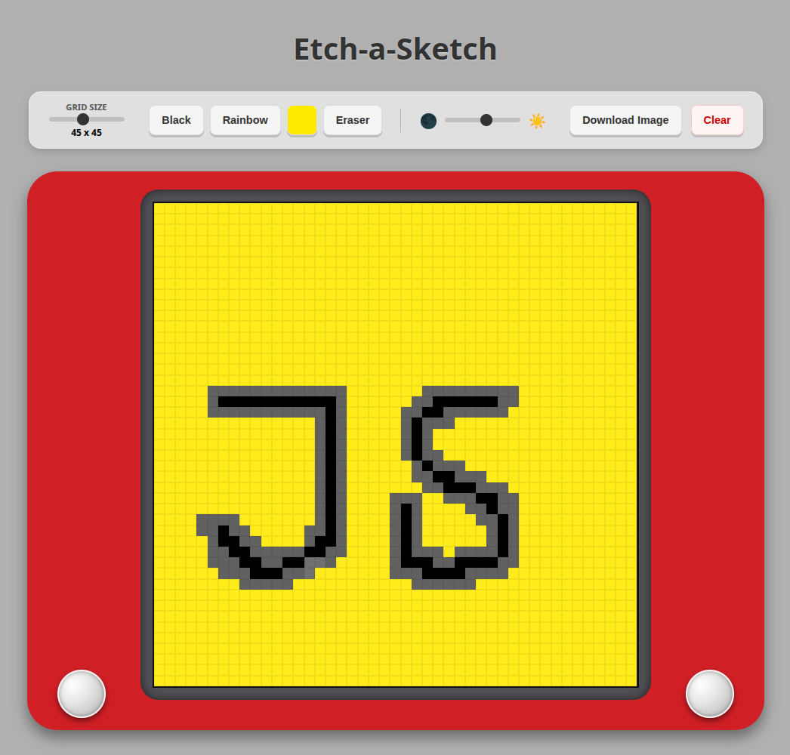

## 🔧 Tech Stack


# Etch-a-Sketch Project
An interactive drawing grid built with vanilla JavaScript as part of **The Odin Project** foundations curriculum.

## 🚀 Live Demo
👉 https://mariaingerslev.github.io/etch-a-sketch/

## 📸 Screenshot


## 🎮 Features
- **Dynamic Grid Generation:** Creates a square grid of divs fully in JavaScript (no hard-coded HTML tiles).
- **Resizable Canvas:** User can choose grid size (e.g., from 16×16 up to 100×100), and the board re-renders accordingly.
- **Auto-Sized Squares:** Each square’s size is calculated in JS based on `CONTAINER_SIZE / gridSize`, keeping the sketch area fixed.
- **Hover Drawing Effect:** Squares change appearance when hovered using `mouseenter` event listeners.
- **Clear & Reset:** A control allows clearing the board and regenerating the grid with a new size.

## 🔧 What I Improved & Solved
- **DOM Manipulation Practice:** Used `document.createElement`, `appendChild`, and `classList` to build and style the grid dynamically.
- **User Input Validation:** Restricted grid size to a safe range (1–100) to avoid performance and layout issues.
- **Layout Consistency:** Ensured the drawing area stays centered and fixed-width while still supporting different grid densities.

## 📂 Project Structure

```bash
/etch-a-sketch
│── index.html              # HTML structure & control panel
│── style.css               # Layout, flexbox/grid styling, and hover visuals
│── script.js               # Grid generation, events, and resize/reset logic
│── README.md               # Project documentation
└── assets/
    └── images/
        └── etch-a-sketch.png/    # Screenshots and visual assets
```

## 📚 What I Learned
- **Dynamic Layouts with JS:** How to generate and update many DOM elements efficiently based on user input.
- **Event-Driven UI:** Using `mouseenter` for drawing interactions instead of click-based events.
- **Responsive Styling:** Combining a fixed container size with flexible grid sizing for a consistent user experience.

## ▶️ How to Run Locally
1. Clone the repository:
   ```bash
   git clone https://github.com/your-username/etch-a-sketch.git
   ```
2. Navigate into the project folder:
   ```bash
   cd etch-a-sketch
   ```
3. Open `index.html` directly in your browser, or use a simple local server (e.g., VS Code Live Server).
